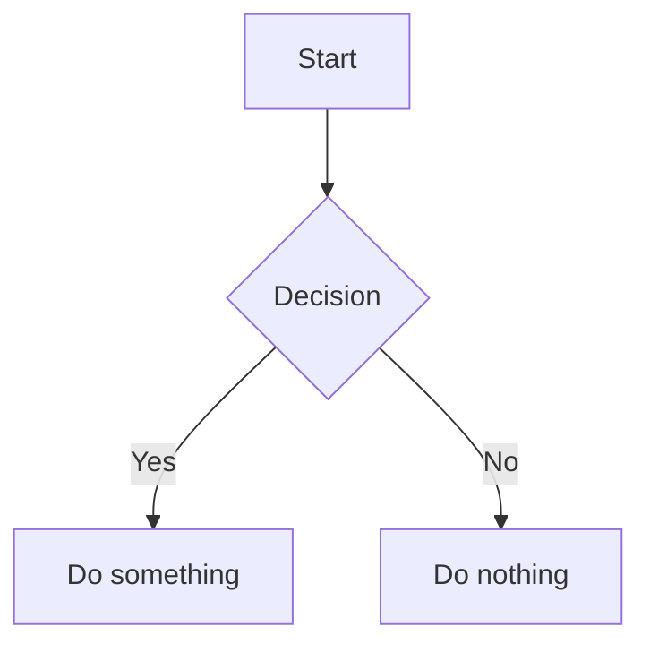

# md2pdf

> Convert interlinked Markdown files to a beautiful, GitHub-styled PDF — with Mermaid diagrams, LaTeX math, working internal links, and syntax-highlighted code.

[](LICENSE)
[](https://python.org)
[](https://nodejs.org)

---

## Features

- **Recursive link following** — starts from `home.md` or `index.md` and follows every relative `.md` link (BFS order), assembling all pages into one PDF
- **Mermaid diagrams** — `flowchart`, `sequenceDiagram`, `classDiagram`, `gitGraph`, and more rendered as crisp PNGs
- **LaTeX math** — `$inline$` and `$$display$$` math rendered server-side via [KaTeX](https://katex.org) (no browser needed)
- **GitHub-style CSS** — Inter/system font stack, syntax-highlighted code blocks (Pygments), tables, task lists, blockquotes
- **Working internal links** — cross-document `[text](other.md#heading)` links become clickable PDF bookmarks
- **Page options** — portrait/landscape, custom margins
- **Wiki-style links** — `[[Page]]` and `[[Page|Label]]` syntax supported
- **Installer-managed Chromium setup** — `install.sh` / `install.ps1` download `chrome-headless-shell`

---

## Requirements

| Tool | Minimum version | Notes |
|------|----------------|-------|
| Python | 3.9+ | Add to PATH on Windows |
| Node.js | 18+ | [nodejs.org](https://nodejs.org) |
| npm | 9+ | Bundled with Node.js |

---

## Installation

### Linux / macOS

```bash
git clone https://github.com/your-username/md2pdf.git
cd md2pdf
bash install.sh
```

To verify an existing installation without changing anything:

```bash
bash install.sh --check
```

### Windows

Open **PowerShell** (no admin required) and run:

```powershell
git clone https://github.com/your-username/md2pdf.git
cd md2pdf
.\install.ps1
```

To verify only:

```powershell
.\install.ps1 -Check
```

> **Tip:** If you get a script execution policy error, run:
> ```powershell
> Set-ExecutionPolicy -Scope CurrentUser -ExecutionPolicy RemoteSigned
> ```

### What the installer does

1. Checks Python 3.9+ and Node.js 18+ are on `PATH`
2. Tries installing Python packages: `weasyprint`, `markdown`, `pymdown-extensions`, `pygments`
3. If global Python install fails, asks whether to create a new virtual environment or use an existing one
4. Runs `npm install` (pulls `@mermaid-js/mermaid-cli` + Puppeteer)
5. Pre-downloads the Chromium headless shell binary (~113 MB) for Mermaid CLI

### Manual installation

```bash
# Python dependencies
pip install -r requirements.txt

# Node dependencies
npm install
```

Download Chromium headless shell via installer scripts (`install.sh` / `install.ps1`).
If skipped, Mermaid rendering can fail at runtime.

---

## Usage

```bash
python3 md2pdf.py <input> [output.pdf] [options]
```

| Argument | Description |
|----------|-------------|
| `input` | Directory (auto-finds `home.md`/`index.md`) or a single `.md` file |
| `output` | Output PDF path (default: `<input>/output.pdf`) |
| `-o <p\|l>` | Orientation — `p` portrait *(default)*, `l` landscape |
| `-m T L B R` | Margins in mm — top, left, bottom, right *(default: 20 20 25 20)* |

### Examples

```bash
# Convert a docs directory (auto-detects home.md)
python3 md2pdf.py docs/

# Explicit output path
python3 md2pdf.py docs/ manual.pdf

# Landscape with narrow margins
python3 md2pdf.py docs/ manual.pdf -o l -m 12 10 15 10

# Single file
python3 md2pdf.py README.md output.pdf

# Portrait with wide margins
python3 md2pdf.py wiki/ wiki.pdf -m 25 30 25 30
```

### Shortcut alias

**Linux/macOS** — add to `~/.bashrc` or `~/.zshrc`:
```bash
alias md2pdf='python3 /path/to/md2pdf/md2pdf.py'
```

**Windows** — add to your [PowerShell profile](https://learn.microsoft.com/en-us/powershell/module/microsoft.powershell.core/about/about_profiles) (`$PROFILE`):
```powershell
function md2pdf { python 'C:\path\to\md2pdf\md2pdf.py' @args }
```

---

## How it works

```
input directory
      │
      ▼
 home.md / index.md          ← entry point
      │
      ▼
 BFS link traversal           ← follows [text](page.md) and [[Page]] links
      │
      ├─ render_math_blocks()  ← KaTeX: $...$ and $$...$$ → HTML spans
      ├─ render_mermaid_blocks() ← mmdc: ```mermaid → PNG images
      ├─ rewrite_image_paths() ← relative imgs → absolute file:// URIs
      ├─ md_to_html_fragment() ← python-markdown + pymdownx extensions
      ├─ prefix_heading_ids()  ← prevents id collisions across documents
      └─ rewrite_internal_links() ← .md hrefs → #anchor-id

      │
      ▼
 build_html()                  ← single HTML document + GitHub CSS + KaTeX CSS
      │
      ▼
 weasyprint → PDF              ← A4/Letter, page numbers, configurable margins
```

---

## Document structure

md2pdf works best with a documentation site structure:

```
docs/
├── home.md          ← or index.md — this is the entry point
├── guide/
│   ├── install.md
│   └── usage.md
├── api/
│   └── reference.md
└── images/
    └── diagram.png
```

Links between pages use standard relative Markdown syntax:

```markdown
See the [Installation Guide](guide/install.md) for setup steps.
Or jump to [API Reference](api/reference.md#methods).
```

---

## Math syntax

Inline math with single `$`:

```markdown
The loss function is $L = \frac{1}{n}\sum_{i=1}^n (y_i - \hat{y}_i)^2$.
```

Display math with double `$$`:

```markdown
$$
\theta_{t+1} = \theta_t - \eta \cdot \frac{\hat{m}_t}{\sqrt{\hat{v}_t} + \epsilon}
$$
```

---

## Mermaid diagrams

````markdown

````

> **Note:** Node labels containing `()` or `||` are automatically quoted by md2pdf before rendering, so diagrams like `node[func()]` work without manual escaping.

---

## Project layout

```
md2pdf/
├── md2pdf.py          # main script (cross-platform)
├── katex_render.js    # Node helper — batch-renders LaTeX → KaTeX HTML
├── install.sh         # installer for Linux / macOS
├── install.ps1        # installer for Windows (PowerShell)
├── requirements.txt   # Python dependencies
├── package.json       # Node dependencies
├── LICENSE            # MIT
└── README.md
```

---

## Troubleshooting

**`mmdc not found`** — run `bash install.sh` to install Node packages.

**`weasyprint` import error** — run `pip install -r requirements.txt`.

**Mermaid diagrams show as code** — the diagram has a syntax error. Check the `[warn] mmdc error` message in the output. Labels with `()` or `||` are auto-fixed; other errors (e.g. unknown node type) need fixing in the source.

**Math shows as raw `$...$`** — ensure `katex_render.js` is present next to `md2pdf.py` and `node` is on your PATH.

**Fonts look wrong in PDF** — weasyprint uses system fonts. Install the `fonts-inter` package (Linux) or any sans-serif system font.

**Windows: `Set-ExecutionPolicy` error** — run `Set-ExecutionPolicy -Scope CurrentUser -ExecutionPolicy RemoteSigned` then retry.

**Windows: `pip install` fails with permission error** — use `pip install --user -r requirements.txt` or run inside a virtual environment (`python -m venv .venv && .venv\Scripts\activate`).

**Chrome headless shell download fails** — rerun installer with stable connection, check proxy/firewall access to `storage.googleapis.com`, or download manually from installer URL and extract to Puppeteer cache path shown by installer.

---

## License

[MIT](LICENSE) © 2026 md2pdf ensismoebius

